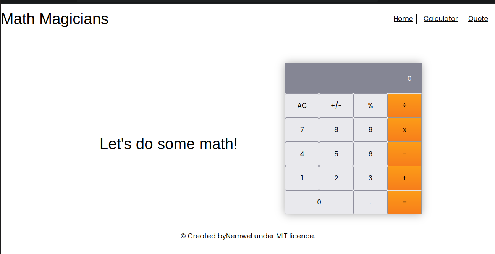
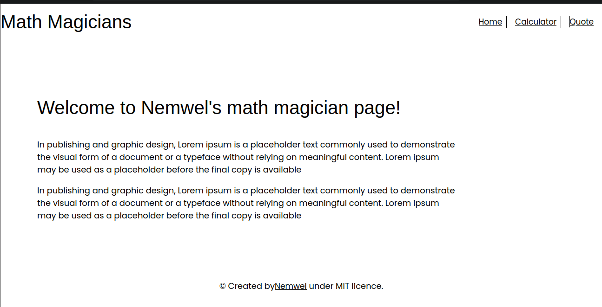
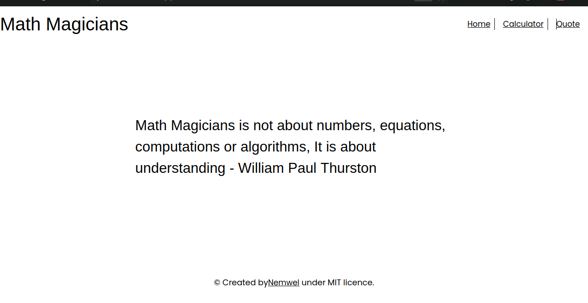

# math-magicians

Math magicians is a single page application that features three pages: A Home page with some welcoming textx, A Calculator page which has a page with a calculator that you can o math with and a Quotes page which has a quote about what "Math magicians are".
Enjoy!

## Built With

- HTML5
- CSS
- Javascript
- React
- Webpack
- Linters

## Live Demo

A live version of the project can be seen [here](https://extraordinary-brigadeiros-b53b16.netlify.app/)

## Getting Started

To get a local copy up and running follow these simple example steps.

## Install

In your terminal, navigate to your current directory and run this code

`git@github.com:Nemwel-Boniface/math-magicians.git`

Locate the directory in your file explorer

`cd math-magicians`

Install npm or if installed already using this link

`npm install`

Start the web dev server depending on your configuration

`npm start`

The Project should now be live on your browser

## Authors

👤 **Author1**

- GitHub: [@Nemwel-Boniface ](https://github.com/Nemwel-Boniface)
- Twitter: [@nemwel_bonie](https://twitter.com/nemwel_bonie)
- LinkedIn: [LinkedIn](https://www.linkedin.com/in/nemwel-nyandoro-aa1b2620b/)

Contributions, issues, and feature requests are welcome!

Feel free to check the [issues page](https://github.com/Nemwel-Boniface/math-magicians/issues).

## Show your support

Give a ⭐️ if you like this project!
## 📝 License

This project is [MIT](./MIT.md) licensed.